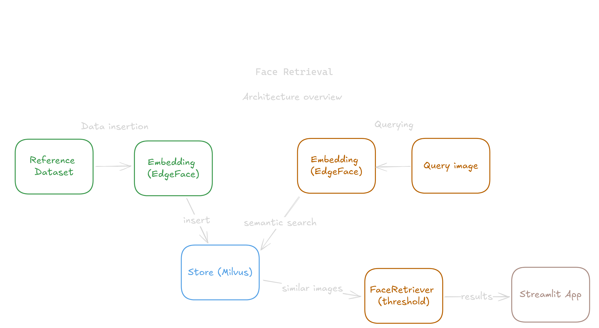

# SENTINEL Face Retrieval

SENTINEL Face Retrieval is an image similarity search system that allows for extremely fast face retrieval, even when the search space has 1+ million points. Designed to work with CPU-only machines, focused on edge applications where the compute resources are limited.

Note: While SENTINEL Face Retrieval is optimized to work on CPU-only machines, and it would be certainly faster with GPUs, the application is extremely fast, check the Performance section.

<p align="center">
  <video src="assets/readme/demo.mp4" width="800" align="middle" controls></video>
</p>

### Architecture

This repository has three main modules:

- Embedding (feature_extraction): An ultra-lightweight face feature (embeddings) extractor, based on [EdgeFace](https://github.com/otroshi/edgeface) - a model optimized to work with edge devices. The default model here is the small version, with 3.65 million parameters and around 3 Gflops. This implementation is aimed to work on CPU-only machines (onnxruntime), but it can be accelerated with GPUs also (onnxruntime-gpu).
- Store (vector_store): A vector store based on the great [Milvus](https://github.com/milvus-io/milvus) vector database. This is the most important part of the whole face retrieval system, it is here where all the embeddings are stored, and it is Milvus the one that powers the super-fast similarity search features over which our FaceRetrieval object is created.
- FaceRetriever (vector_store): A wrapper of the MilvusClient.search function, that removes most of the boilerplate by using several default values, the user can still configure everything, but this helps to reduce the code one needs to write to perform search operations in the vector database. By default, this retriever gets the top-50 most similar images to the query, and then applies a threshold (default to 0.5 but customizable) to filter only the images with a similarity above that threshold.

<p align="center">
  
</p>

Additionally, some helper functionalities are included:

- Face detector (face_detection): A lightweight face detector based on [YOLOv6-face](https://github.com/meituan/YOLOv6/tree/yolov6-face), the default model is the nano version of the detector, with only 4.63 million parameters, and 11.35 Gflops. Implementing bigger and better versions of this detector is straightforward. This implementation is aimed to work on CPU-only machines (onnxruntime), but it can be accelerated with GPUs also (onnxruntime-gpu). This is useful to detect faces while inserting data into Milvus (EdgeFace only works with face crops) and while recommending a bbox for the query in the Streamlit app.

## Set up

With Docker, the set up is as easy as it gets, just clone the repository and then run: `docker compose up -d`

This will pull all the repositories and build the image. This will also launch the Streamlit app, which should be available at `http://localhost:8501/`

Since the vector database only stores absolute paths to the actual images (I will improve this for 2.x), you will need to mount the volumes where your data will be located, either by using the `docker-compose.yaml` file, or by creating a `docker-compose.override.yaml` file (recommended). The override file could contain something like:

```
services:
  sentinel-face-retrieval:
    volumes:
      - "<absolute/path/to/your/data>:<absolute/path/to/your/data>"
```

## Usage

If the `docker compose up -d` ran correctly, everything must be working, you can check the Streamlit app on `http://localhost:8501/`. Obviously, you need to first insert some data into the vector database before being able to search.

#### Inserting data into Milvus
1. Download or gather some data with faces (LFW or CelebA datasets will work), for now, this project only works with 1 face per image.
2. Insert the data into Milvus by running `python3 -m vector_store.insert_face_data --data_path <path/to/your/dataset>` (the source code for this script is [here](vector_store/insert_face_data.py)). It will take some time, since this process involves detecting faces, extracting features and inserting the data into Milvus.
3. Once you have inserted your data, go back to `http://localhost:8501/`, select your query image of a person you know is in the dataset you inserted, then a bounding box will be automatically recommended, and you will get the most similar results to the face you inserted.

## Performance notes

Use these performance metrics as reference. Refer to each individual project (yolov6-face, edgeface, milvus) to find deeper performance analysis. A notebook with the profiling process is available [here](notebooks/profiling.ipynb).

#### Test environment
- os: pop-os 22.04
- hardware: 13th Gen Intel® Core™ i7-13650HX
- runtime: onnxruntime v1.19 cpu

#### Face detection
- task: Face detection with NMS on a 250x250 image with only 1 face.
- model: yolov6-face nano, .onnx

Results: `20.2 ms ± 271 μs per loop (mean ± std. dev. of 7 runs, 100 loops each)`

Note: these times includes all the pre-processing (letterbox, resizing, transposing) and post-processing (coord scale, nms) operations

#### Feature extraction
- task: Feature extraction (dim=512) on a 250x250 image, with only 1 face.
- model: edgeface_s_gamma_05, .onnx

Results: `2.87 ms ± 73.9 μs per loop (mean ± std. dev. of 7 runs, 100 loops each)`

note: these times includes all the pre-processing (resizing, transposing) operations

#### Image retrieval
- task: query a 250x250 image with 1 face, retrieve the top-50 kNN, and filter them by threshold.
- vector_db: Milvus standalone v2.4.10
- search_space_size: 85,000 images, lfw funneled dataset + partial CelebA dataset

Results: `5.31 ms ± 116 μs per loop (mean ± std. dev. of 7 runs, 100 loops each)`

Search - feature extraction: `5.31 ms - 2.87 ms = 2.44 ms`

note: these times include the time of the query feature extraction, as well as some post-processing (filtering by threshold)

## Roadmap for 2.x

The 2.x version of SENTINEL Face Retrieval will include features such as:

- Improved file management, so you don't need to mount absolute paths into the container.
- Image search and retrieval using full frame images (multiple faces per frame), which will enable the user
to search in natural databases.
- Search for an specific person in a set of videos.

## Acknowledgments

- Thanks to [Milvus](https://github.com/milvus-io/milvus) for this great vector database open-source. Also thanks for the excellent documentation and set of tutorials you provide.
- Thanks to the [YOLOv6](https://github.com/meituan/YOLOv6) team for its excellent face detector and their efforts on making this model accesible.
- Thanks to the [EdgeFace](https://github.com/otroshi/edgeface) team for open-sourcing their ultra-fast models.